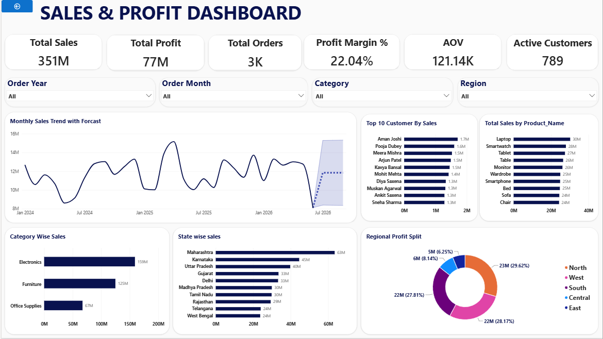
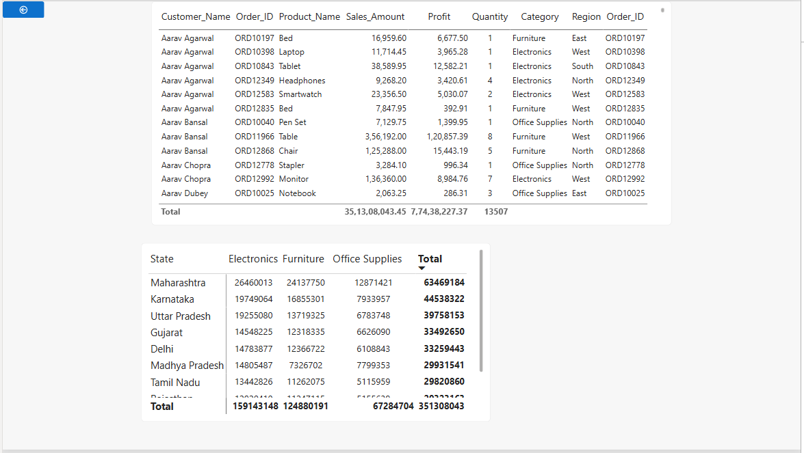

# -Day10_Sneha_PowerBi
# Sales & Profit Dashboard

## Project Overview

This Power BI dashboard provides an interactive analysis of sales and profitability performance across products, customers, states, and regions. The dashboard enables users to monitor key business metrics, identify trends, and support data-driven decision-making through visual analytics.

## Dashboard Pages

### Summary Dashboard

The summary page presents high-level business performance indicators including sales, profit, orders, profit margin, sales trends, regional analysis, and top-performing products and customers.

### Detailed Analysis Dashboard

The detailed page provides deeper insights through drill-through analysis, detailed transaction-level information, customer performance analysis, and additional business metrics.

## Dashboard Screenshots

### Summary Dashboard

### Detailed Analysis Dashboard

## Tools Used

* Power BI
* Power Query
* DAX
* Microsoft Excel

